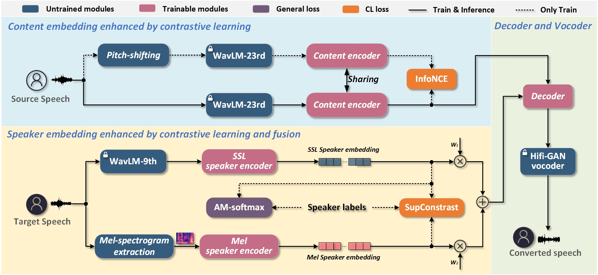

# 
 CLESSR-VC: Contrastive Learning Enhanced Self-Supervised Representation for One-shot Voice Conversion

# ABSTRACT

 One-shot voice conversion (VC) has attracted more and more attention due to its broad prospects for practical application. In this task, the representation ability of speech features and the model's generalization are the focus of attention. This paper proposes a model called CLESSR-VC, which enhances pre-trained self-supervised learning (SSL) representations through contrastive learning for one-shot VC. First, SSL features from the 23rd and 9th layers of the pre-trained WavLM are adopted to extract content embedding and SSL speaker embedding, respectively, to ensure the model's generalization. Then, the conventional acoustic feature mel-spectrograms and contrastive learning are introduced to enhance the representation ability of speech features. Specifically, contrastive learning combined with the pitch-shift augmentation method is applied to disentangle content information from SSL features accurately. Mel-spectrograms are adopted to extract mel speaker embedding. AM-Softmax and cross-architecture contrastive learning are applied between SSL and mel speaker embeddings to obtain the fused speaker embedding that helps improve speech quality and speaker similarity. Both objective and subjective evaluation results on the VCTK corpus confirm that the proposed VC model has outstanding performance and few trainable parameters.

The following is the overall model architecture.

  
  
Fig.1: The overall architecture of the proposed model.

# DEMO
For the converted samples, you can visit [the demo page](https://superman-valencia.github.io/CLESSR-VC-Demo/).